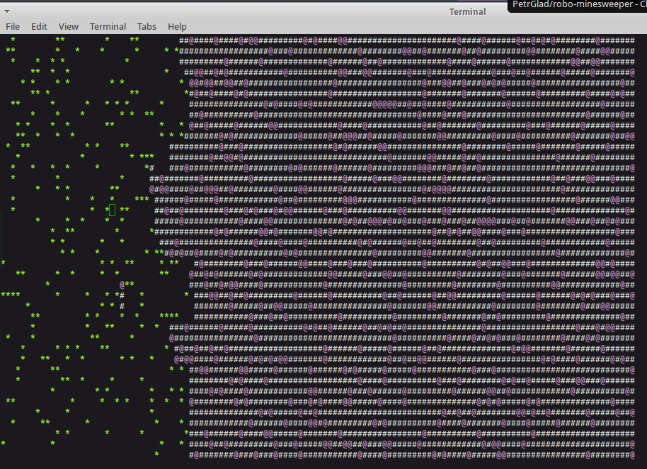

robo-minesweeper
================

Program that automatically plays [Minesweeper game](https://en.wikipedia.org/wiki/Minesweeper_(video_game)).



In ambiguous situations algorithm attempts to minimize risk.
The algorithm:
 1. Enumerate all mine layouts that are consistent with intel. 
 2. Find probabilities of a mine in an unknown position. 
 3. Probe positions with least probability of mine in them.
 
Number of mines is not provided to algorithm (original game does show total number of mines). 
Tactics that relay on this number might be useful in endspiel - those are not implemented
(see also TODO comments in Algorithm.hs).

To build:
```
  cabal build
```  

To run:
```
  dist/build/robominer/robominer
```  
or specify rows, columns, mines count:
```
    dist/build/robominer/robominer 128 64 1200
```    
In case of dense fields try (set -N parameter to number of cores or threads in your processor):
```
  dist/build/robominer/robominer +RTS -N4 -K256m -RTS 128 64 1500
```    
(It still may take forever to complete but at least it does not fail with an exception)

Add "Fancy" to run with alternative algorithm
```
  dist/build/robominer/robominer 128 64 1000 Fancy
```    
This algorithm prefers to sweep empty areas first as does original game automatically.
Due to smaller sweeps this algorithm runs slower because requires more rendering.
On sparse fields it would be as fast as the default one.

Also as this algorithm postpones hard work for later it may accrue too big chains for real analysis. 
This means that it often hangs on moderately dense fields. Try, for example, `robominer 164 64 1300`
which in most cases processed well by Default algorithm but overloads Fancy.   

Results
-------

It certainly plays minesweeper better (and a lot faster) than me what I wanted to achieve initially.
Winrate with usual settings:

* Beginner: 8 × 8 field with 10 mines (density 0.156) - 56%
* Intermediate: 16 × 16 field with 40 mines (density 0.156) - 55%
* Expert: 30 × 16 field with 99 mines (density 0.206) - 32%

See 'scripts' subdirectory for scripts that calculate winrate.

Hints
-----

### Game replay
You may store output of robominer into a file and later output it to ANSI-compatible
terminal for replay. For example:
```
  time dist/build/robominer/robominer +RTS -N2 -K200m -RTS 164 64 1000  Fancy >robo.log
  cat robo.log
```
(This also shows that ~50-70% of running time is spent redrawing board.)

### Build
Init cabal sandbox to avoid libraries version conflicts:
  cabal sandbox init
  cabal install --only-dependencies

TODO
----

* Implement remaining mines count heuristics (stepping randomly into unexplored area) 
* Cleanup/streamline code
* Profile to find out why positions enumeration takes very long time sometimes (in hope it can be optimized).
  
